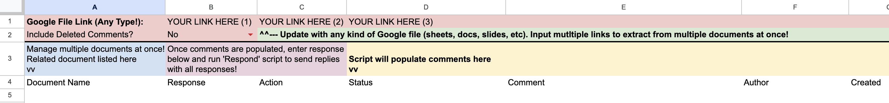

# gsuite-comment-extractor
Template and Google Apps Script to programmatically summarize and respond to comments within a Google File

## Instructions:
1. Make a copy of the Google Sheet in your own Drive (or setup as shown)
2. Add link to the relevant Google file(s) (Document, Spreadsheet, Slides, or any other!)
3. Select whether to include deleted comments
	
### Summarize Comments
4. Select 'Get Comments' from the Comments Menu on the toolbar above
	
### Respond to Comments
5. Populate the 'response' column with your comment replies, AND/OR
6. Populate the 'action' column indicated your desired action
7. Select 'Respond' from the Comments Menu on the toolbar above
	
## Steps Script will Take:
	
### Summarize Comments
1. Get list of all comments in the Google File
2. Clear old data from spreadsheet
3. Summarize relevant information for each comment
4. Update table formatting
	
### Respond to Comments
1. Checks if a response was provided for each comment
2. If response was provided, add reply to relevant comment